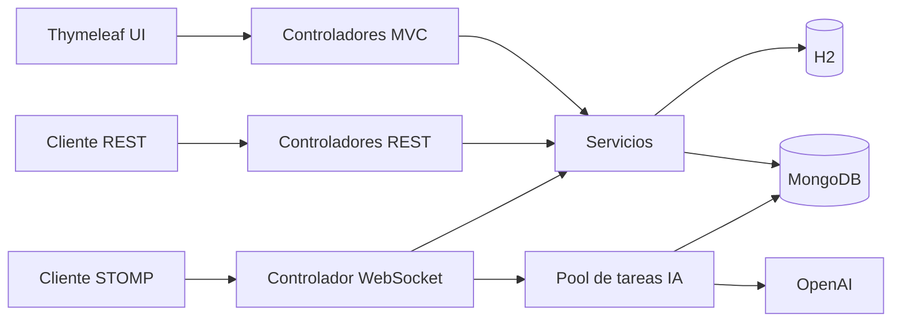

# LibroTech + ChatTech

MVP full-stack para la gestión de un catálogo bibliográfico con una sala de chat en tiempo real y un asistente opcional basado en OpenAI.

El proyecto combina una API REST, un panel web renderizado con Thymeleaf, persistencia relacional para el catálogo y persistencia documental para el historial del chat.

## Funcionalidades

- CRUD REST de libros y categorías.
- Listado de libros con paginación y ordenamiento.
- Panel web para consultar y registrar libros.
- Documentación interactiva con Swagger UI.
- Chat global en tiempo real mediante WebSocket, STOMP y SockJS.
- Historial del chat persistido en MongoDB.
- Respuestas de LibroBot IA mediante Spring AI y OpenAI.
- Contexto limitado a los 10 mensajes más recientes.
- Ejecución de las respuestas de IA en un pool de tareas administrado por Spring.
- Pruebas unitarias, JPA y MongoDB con JUnit, Mockito y Testcontainers.

## Tecnologías

| Área | Tecnología |
| --- | --- |
| Backend | Java 17, Spring Boot 3.4 |
| API | Spring Web, OpenAPI/Swagger |
| Persistencia relacional | Spring Data JPA, Hibernate, H2 |
| Persistencia documental | Spring Data MongoDB, MongoDB 7.0.43 |
| Tiempo real | WebSocket, STOMP, SockJS |
| IA | Spring AI, OpenAI |
| Vistas | Thymeleaf, HTML, CSS, JavaScript |
| Pruebas | JUnit 5, Mockito, Testcontainers |
| Infraestructura local | Docker Compose |

## Arquitectura



La aplicación mantiene dos áreas funcionales:

- **LibroTech:** catálogo de libros y categorías almacenado mediante JPA/H2.
- **ChatTech:** conversación en tiempo real, historial MongoDB y asistente de IA opcional.

## Requisitos

- Java 17 o superior.
- Maven 3.9 o superior.
- Docker y Docker Compose.
- Una clave de OpenAI únicamente si se desea habilitar LibroBot IA.

## Ejecución local

Iniciar MongoDB:

```bash
docker compose up -d
```

Iniciar la aplicación:

```bash
mvn spring-boot:run
```

La integración con OpenAI está deshabilitada por defecto. El chat sigue funcionando y LibroBot informa que el modelo no está configurado.

Para habilitar OpenAI:

```bash
export AI_CHAT_MODEL=openai
export OPENAI_API_KEY=tu_clave
mvn spring-boot:run
```

Detener MongoDB:

```bash
docker compose down
```

Para eliminar también sus datos locales:

```bash
docker compose down -v
```

## Rutas web

| Página | URL |
| --- | --- |
| Catálogo | <http://localhost:8080/admin/libros> |
| Nuevo libro | <http://localhost:8080/admin/libros/nuevo> |
| Sala de chat | <http://localhost:8080/admin/chat> |
| Swagger UI | <http://localhost:8080/swagger-ui.html> |
| Consola H2 | <http://localhost:8080/h2-console> |

Datos locales para H2:

```text
JDBC URL: jdbc:h2:file:./data/librotech_db
User Name: sa
Password: vacío
```

## API REST

### Libros

```http
GET    /api/libros
GET    /api/libros/{id}
GET    /api/libros/autor/{autor}
POST   /api/libros
PUT    /api/libros/{id}
DELETE /api/libros/{id}
```

Ejemplos de paginación y ordenamiento:

```http
GET /api/libros?page=0&size=5
GET /api/libros?sort=autor,desc
GET /api/libros?page=0&size=10&sort=titulo,asc
```

### Categorías

```http
GET    /api/categorias
GET    /api/categorias/{id}
POST   /api/categorias
PUT    /api/categorias/{id}
DELETE /api/categorias/{id}
```

### Mensajes

```http
GET /api/mensajes
```

### WebSocket

| Uso | Destino |
| --- | --- |
| Conexión SockJS | `/chat-websocket` |
| Envío STOMP | `/app/enviar` |
| Suscripción STOMP | `/tema/mensajes` |

## Configuración

| Variable | Valor predeterminado | Descripción |
| --- | --- | --- |
| `MONGODB_URI` | MongoDB local de Compose | Conexión para el historial |
| `AI_CHAT_MODEL` | `none` | Usar `openai` para habilitar IA |
| `OPENAI_API_KEY` | Vacío | Clave de OpenAI |
| `CHAT_ALLOWED_ORIGINS` | `http://localhost:8080` | Orígenes WebSocket separados por comas |

No se deben almacenar claves reales en el repositorio.

## Pruebas

Con Docker activo:

```bash
mvn test
```

Testcontainers inicia una instancia temporal y aislada de MongoDB. No es necesario levantar el servicio de `docker-compose.yml` para ejecutar las pruebas.

La suite cubre:

- Repositorios JPA de libros y categorías.
- Repositorio MongoDB y consulta de los últimos 10 mensajes.
- Validación y persistencia del servicio de mensajes.
- Protección de campos administrados por el servidor.
- Fallback cuando OpenAI no está configurado.
- Flujo del controlador WebSocket hacia la respuesta del bot.
- Arranque del contexto de Spring.

## Decisiones de diseño

- OpenAI es opcional para que el proyecto pueda evaluarse sin compartir una clave privada.
- Los identificadores y fechas de mensajes se generan en el servidor.
- `LibroBot IA` es un nombre reservado y no puede utilizarse como remitente desde el cliente.
- Los nombres se limitan a 60 caracteres y los mensajes a 2000.
- Las llamadas de IA se ejecutan en un pool acotado para evitar crear un hilo por mensaje.
- H2 y los datos iniciales facilitan la demostración local del catálogo.

## Alcance y limitaciones

Este repositorio es un MVP de portafolio, no un sistema listo para producción.

- No incluye autenticación ni autorización.
- El chat utiliza una única sala compartida.
- H2, su consola y los datos de demostración están orientados al entorno local.
- Antes de exponerlo públicamente se deben añadir seguridad, perfiles de entorno, una base de datos de producción, rate limiting y gestión de secretos.

## Evidencias

- [Validación WebSocket en dos pestañas](docs/evidencias/websocket-dos-pestanas.md)
- [Integración final LibroTech + ChatTech](docs/evidencias/integracion-final-chattech.md)
